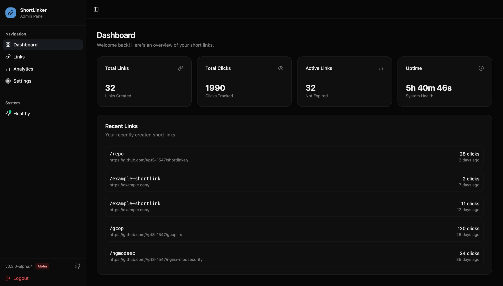

# shortlinker

<div align="center">

[](https://github.com/AptS-1547/shortlinker/releases)
[](https://github.com/AptS-1547/shortlinker/actions/workflows/rust-release.yml)
[](https://github.com/AptS-1547/shortlinker/actions/workflows/docker-image.yml)
[](https://www.codefactor.io/repository/github/apts-1547/shortlinker)
[](https://opensource.org/licenses/MIT)
[](https://hub.docker.com/r/e1saps/shortlinker)

A minimalist URL shortener service supporting HTTP 307 redirection, built with Rust.

[English](README.md) | [中文](README.zh.md)



</div>

## Features

- High performance with Rust + Actix-web
- Multiple storage backends: SQLite, MySQL, PostgreSQL
- Dynamic link management without restart
- Custom and random short codes
- Expiration support with flexible time formats
- Password-protected links
- Admin API with Bearer token authentication
- Web admin panel
- TUI mode for terminal users
- Docker and Unix socket support

## Quick Start

**Docker:**

```bash
docker run -d -p 8080:8080 -v $(pwd)/data:/data e1saps/shortlinker
```

**Local:**

```bash
git clone https://github.com/AptS-1547/shortlinker && cd shortlinker
cargo run
```

## CLI Usage

```bash
./shortlinker                                    # Start server
./shortlinker tui                                # TUI mode (requires 'tui' feature)
./shortlinker add github https://github.com     # Custom code
./shortlinker add https://example.com           # Random code
./shortlinker add secret https://example.com --password mypass  # Password protected
./shortlinker add temp https://example.com --expire 7d          # Expires in 7 days
./shortlinker list                              # List all links
./shortlinker remove github                     # Remove link
./shortlinker export links.csv                  # Export to CSV
./shortlinker import links.csv                  # Import from CSV
```

## Admin API

```bash
# Set token
export ADMIN_TOKEN=your_secret_token

# List all links
curl -H "Authorization: Bearer $ADMIN_TOKEN" http://localhost:8080/admin/v1/links

# Create link
curl -X POST -H "Authorization: Bearer $ADMIN_TOKEN" \
     -H "Content-Type: application/json" \
     -d '{"code":"github","target":"https://github.com","expires_at":"7d"}' \
     http://localhost:8080/admin/v1/links

# Delete link
curl -X DELETE -H "Authorization: Bearer $ADMIN_TOKEN" \
     http://localhost:8080/admin/v1/links/github
```

See [Admin API docs](docs/en/api/admin.md) for batch operations, runtime config, and more.

## Configuration

Generate a config file:

```bash
./shortlinker config generate
```

This creates `config.example.toml` with `server`, `database`, `cache`, `logging`, `analytics`, and `ipc` settings.

See [Configuration docs](docs/en/config/index.md) for all options.

## Documentation

- [Getting Started](docs/en/guide/getting-started.md)
- [Configuration](docs/en/config/index.md)
- [Storage Backends](docs/en/config/storage.md)
- [Admin API](docs/en/api/admin.md)
- [Health API](docs/en/api/health.md)
- [Docker Deployment](docs/en/deployment/docker.md)
- [systemd Service](docs/en/deployment/systemd.md)
- [CLI Commands](docs/en/cli/commands.md)

## Related

- [Web Admin Panel](admin-panel/) - GUI for link management
- [Custom Frontend Template](https://github.com/AptS-1547/shortlinker-frontend/) - Build your own frontend
- [Cloudflare Worker](cf-worker/) - Serverless version

### Custom Frontend

Place your custom frontend in `./frontend-panel` directory. Shortlinker will automatically detect and serve it instead of the built-in panel. See [Admin Panel docs](docs/en/admin-panel/index.md) for parameter injection details.

## License

MIT License © AptS:1547

<pre>
        ／＞　 フ
       | 　_　_|    AptS:1547
     ／` ミ＿xノ    — shortlinker assistant bot —
    /　　　　 |
   /　 ヽ　　 ﾉ      Rust / SQLite / Bloom / CLI
   │　　|　|　|
／￣|　　 |　|　|
(￣ヽ＿_ヽ_)__)
＼二)

   「ready to 307 !」
</pre>
